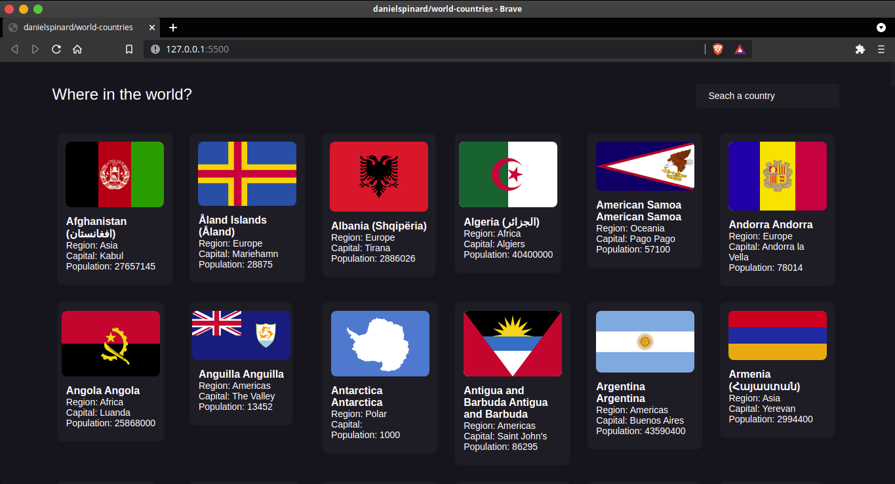
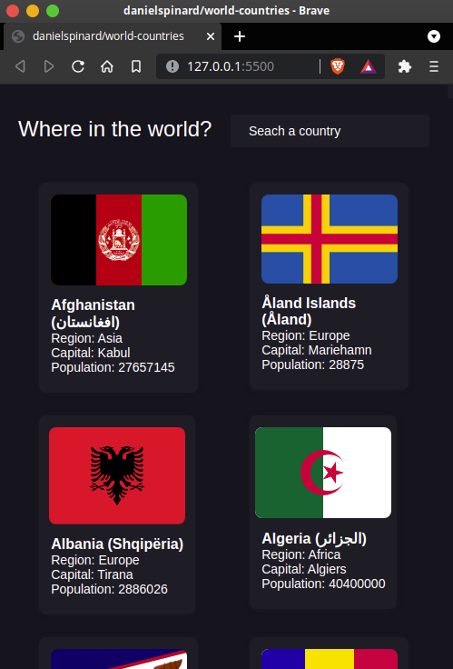

   

## Why the Project?

My goal is to train javascript consuming an API with jquery-ajax, the front-end will be developed in css vanilla.

## Project Preview
This may be an outdated preview and may not represent a final version.

[desktop]

[responsive]

## Developer

Daniel Monteiro - [@danielspinard](https://github.com/danielspinard)
